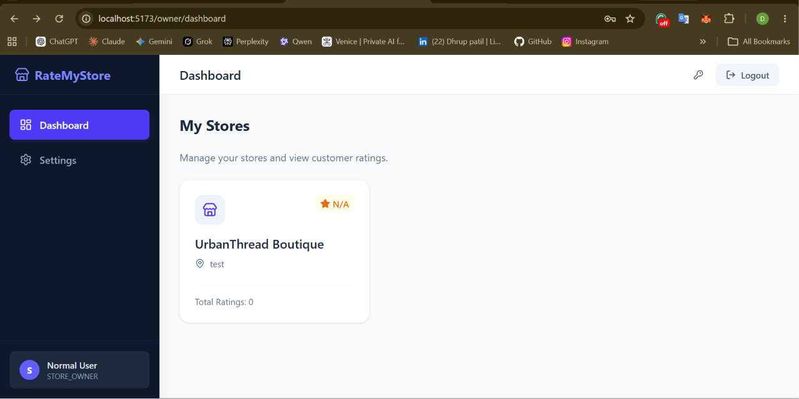
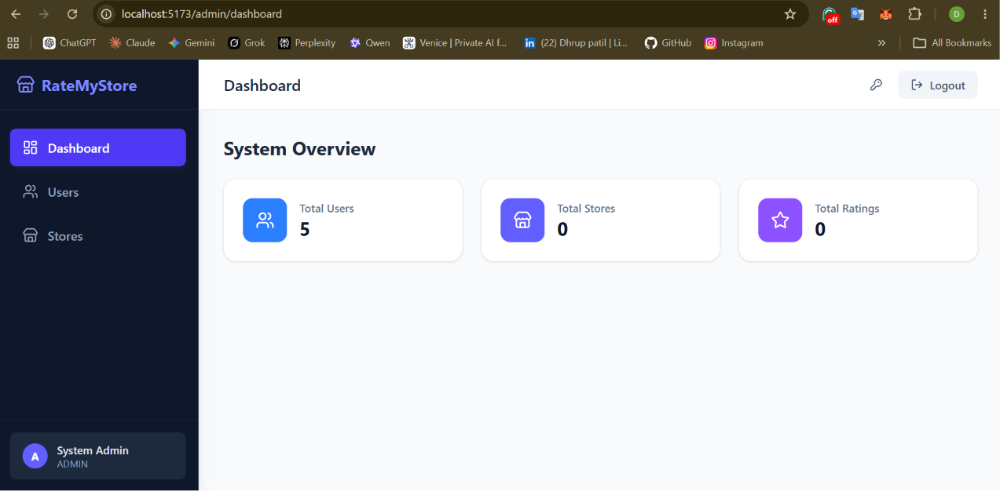
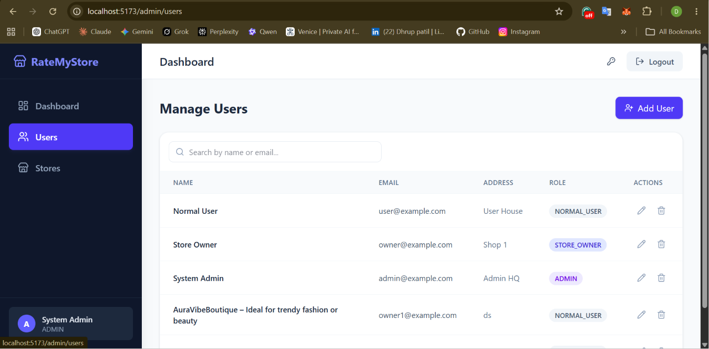
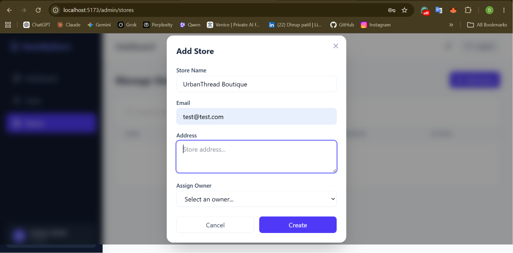

# RateMyStore - Store Rating Platform

A full-stack, role-based web application that allows users to discover local stores, submit ratings, and allows administrators to manage the platform ecosystem. Built with a modern tech stack focusing on performance, clean aesthetics, and secure access control.

## 📸 Screenshots

### User Dashboard (Store Discovery & Rating)


### Store Owner Dashboard


### Admin Dashboard (System Overview)


### Admin User Management


### Admin Store Management


---

## 🚀 Features

The platform implements strict Role-Based Access Control (RBAC) with three distinct user flows:

### 1. System Administrator (`ADMIN`)
- **System Overview:** Access to a dashboard displaying total users, stores, and ratings metrics.
- **User Management:** Create, view, update, and delete users. Includes a role filter and dynamic sorting (Name, Email, Role). Can view the aggregated average rating of Store Owners.
- **Store Management:** Create stores and automatically assign them to specific `STORE_OWNER` accounts via a dropdown. Delete inappropriate stores.
- **Dynamic Sorting:** Tables support sorting by key fields (Name, Email, Address, Avg Rating).

### 2. Store Owner (`STORE_OWNER`)
- **Store Dashboard:** Access a filtered view showing *only* the stores assigned to their specific account.
- **Rating Analytics:** View the overall average rating and total rating count for their businesses.
- **Customer Insights:** Click into a store to see a detailed table of every customer who has rated the store, including their name, email, and exact rating given.

### 3. Normal User (`NORMAL_USER`)
- **Authentication:** Secure self-registration and login.
- **Discovery:** Browse all registered stores and search by Name or Address.
- **Interactive Ratings:** Submit and update ratings (1-5 stars) dynamically directly from the dashboard using an intuitive inline star component. 

---

## 🛠️ Technology Stack

**Frontend:**
- React (Vite)
- Tailwind CSS (Styling & Layouts)
- React Router (Routing)
- Lucide React (Icons)
- React Hook Form (Form Validation)
- Axios (API Communication)

**Backend:**
- Node.js & Express.js
- Prisma ORM
- PostgreSQL (Database)
- JSON Web Tokens (JWT) for Authentication
- Bcrypt (Password Hashing)

---

## ⚙️ Local Setup & Installation

### Prerequisites
- Node.js (v18+)
- PostgreSQL installed and running

### 1. Clone the repository
```bash
git clone <your-repo-url>
cd Store-Rating-Platform
```

### 2. Backend Setup
```bash
cd backend
npm install
```

Create a `.env` file in the `backend` directory:
```env
PORT=5000
DATABASE_URL="postgresql://<user>:<password>@localhost:5432/storerating?schema=public"
JWT_SECRET="your_super_secret_jwt_key_here"
```

Initialize the database:
```bash
# Push the schema to your database
npx prisma db push

# (Optional) Run the seed script to create test users
node scratch.js 

# Start the server
npm run dev
```

### 3. Frontend Setup
Open a new terminal window:
```bash
cd frontend
npm install

# Start the development server
npm run dev
```

The frontend will be accessible at `http://localhost:5173`.

---

## 🔐 Default Test Accounts (If Seeded)
If you ran the seeding script, you can test the roles using these credentials:
- **Admin:** `admin@example.com` / `Admin@1234`
- **Owner:** `owner@example.com` / `Owner@1234`
- **User:** `user@example.com` / `User@1234`

---

### 🎉 Thanks for visiting! 
Thank you for checking out RateMyStore. If you have any questions or feedback, feel free to open an issue or reach out!
